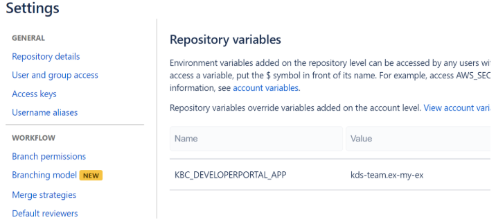

# KBC Component Python template

Python template for KBC Component creation. Defines the default structure and all Bitbucket pipeline CI scripts for automatic deployment.

Use as a starting point when creating a new component.

Example uses [keboola-python-util-lib](https://bitbucket.org/kds_consulting_team/keboola-python-util-lib/src/master/) library providing useful methods for KBC related tasks and boilerplate methods often needed by components, for more details see [documentation](https://bitbucket.org/kds_consulting_team/keboola-python-util-lib/src/master/README.md)


## Recommended component architecture
It is recommended to use the [keboola-python-util-lib library](https://bitbucket.org/kds_consulting_team/keboola-python-util-lib/src/master/), 
for each component. Major advantage is that it reduces the boilerplate code replication, the developer can focus on core component logic 
and not on boilerplate tasks. If anything is missing in the library, please fork and create a pull request with additional changes, 
so we can all benefit from it

**Base components on [KBCEnvHandler](https://bitbucket.org/kds_consulting_team/keboola-python-util-lib/src/master/docs/env_handler.md?at=master)**
- No need to write configuration processing and validation code each time
- No need to setup logging environment manually
- No need to write code to store manifests, write statefile, retrieve dates based on relative period, and meny more.
- The main focus can be the core component logic, which increases the code readability for new comers.

**Base Client on [HtttpClientBase](https://bitbucket.org/kds_consulting_team/keboola-python-util-lib/src/master/docs/client_base.md?at=master)**
- No need to write HTTP request handling over and over again
- Covers basic authentication, retry strategy, headers, default parameters

**Process results using [result.py](https://bitbucket.org/kds_consulting_team/keboola-python-util-lib/src/master/docs/result.md?at=master) 
package**
- No need to use pandas
- Enables basic json response flattening
- Fixed headers, user values and more useful functionality


### Example component
This template contains functional example of an [extractor component](https://bitbucket.org/kds_consulting_team/kbc-python-template/src/master/src/component.py), 
it can be run with [sample configuration](https://bitbucket.org/kds_consulting_team/kbc-python-template/src/master/data/) and it produces valid results. 
It is advisable to use this structure as a base for new components. Especially the `component.py` module, which should only 
contain the base logic necessary for communication with KBC interface, processing parameters, collecting results
 and calling targeted API service methods. 


##Creating a new component
Clone this repository into new folder and remove git history
```bash
git clone https://bitbucket.org:kds_consulting_team/kbc-python-template.git my-new-component
cd my-new-component
rm -rf .git
git init
git remote add origin PATH_TO_YOUR_BB_REPO
git update-index --chmod=+x deploy.sh
git update-index --chmod=+x scripts/update_dev_portal_properties.sh
git add .
git commit -m 'initial'
git push -u origin master
```


##Setting up CI
 - Enable [pipelines](https://confluence.atlassian.com/bitbucket/get-started-with-bitbucket-pipelines-792298921.html) in the repository.
 - Set `KBC_DEVELOPERPORTAL_APP` env variable in Bitbucket (dev portal app id)
 
 
 
 
## Development
 
This example contains runnable container with simple unittest. For local testing it is useful to include `data` folder in the root
and use docker-compose commands to run the container or execute tests. 

If required, change local data folder path to your custom:
```yaml
    volumes:
      - ./:/code
      - ./CUSTOM_FOLDER:/data
```

Clone this repository and init the workspace with following command:

```
git clone https://bitbucket.org:kds_consulting_team/kbc-python-template.git my-new-component
cd my-new-component
docker-compose build
docker-compose run --rm dev
```

Run the test suite and lint check using this command:

```
docker-compose run --rm test
```
 
# Integration

For information about deployment and integration with KBC, please refer to the [deployment section of developers documentation](https://developers.keboola.com/extend/component/deployment/) 